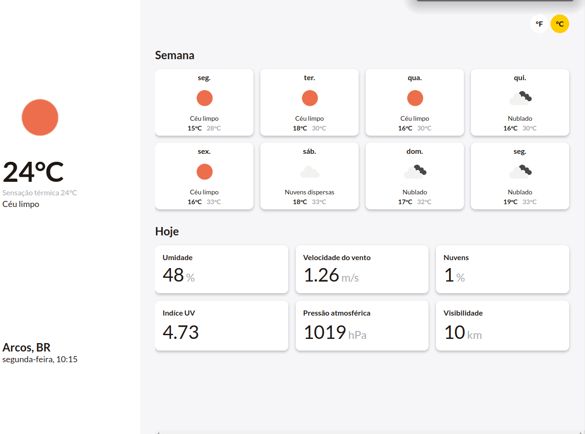

# Desafio front-end Builders
<center>

</center>

- [Desafio front-end Builders](#desafio-front-end-builders)
  - [Sobre o desafio](#sobre-o-desafio)
  - [Dependências](#dependências)
    - [Dependências de produção](#dependências-de-produção)
    - [Dependências de desenvolvimento](#dependências-de-desenvolvimento)
  - [Template](#template)
  - [Executando o projeto](#executando-o-projeto)
  - [🏗️ Estrutura do projeto](#️-estrutura-do-projeto)
    - [Modúlos](#modúlos)
      - [`features/shared`](#featuresshared)
      - [`features/ui`](#featuresui)
      - [`features/weather`](#featuresweather)
  - [Referências](#referências)

## Sobre o desafio
Desenvolva um aplicativo que consuma a localização atual do usuário e exiba na interface o endereço atual os dados climáticos da região e um botão para atualizar os dados. Para fazer essa busca, pode-se usar a API do [Open Weather Map](https://openweathermap.org/).
  
## Dependências 

### Dependências de produção
- [Axios](https://github.com/axios/axios): Cliente HTTP baseado em promises para o navegador e Node.js;
- [Styled-components](https://styled-components.com/): possibilita escrever códigos CSS dentro do JavaScript.

### Dependências de desenvolvimento
- [Commitlint](https://github.com/conventional-changelog/commitlint): Verifica se as mensagens do commit atendem ao formato [Conventional commit](https://www.conventionalcommits.org/en/v1.0.0/)
- [Jest](https://jestjs.io/pt-BR/): biblioteca para escrita de testes em JavaScript;
- [Testing library](https://testing-library.com/): permite testar componentes e hooks React sem depender dos detalhes de implementação. 

## Template
Projeto criado utilizando o [Vite](https://vitejs.dev/guide/#getting-started) juntamente com template `react-ts`. 

## Executando o projeto
- Clonando o projeto e instalando dependências:
```bash
git clone https://github.com/thenriquedb/desafio-front-end-builders
cd desafio-front-end-builders
yarn
```
- Executando em ambiente de desenvolvimento
```bash
yarn dev
```

- Executando os testes
```bash
yarn test
```

## 🏗️ Estrutura do projeto
A estrutura do projeto segue o padrão da estrutura modular. A ideia principal é que cada módulo que definimos tenha todo o código relacionado a ele e apenas o código do próprio módulo seja importado.

Quando temos vários módulos que precisam do mesmo código, podemos escrevê-lo em uma pasta compartilhada e importá-lo para os diferentes módulos. A regra fundamental a ser seguida é não importar código entre módulos.

### Modúlos
#### `features/shared`
Contém o código que será compartilhado entre módulos. 

#### `features/ui`
Contém componentes com casos de uso genérico que podem ser utilizados de diversas maneiras, por exemplo: botão, input,componente de layout entre outros.

#### `features/weather`
Contém todo o código relacionado a funcionalidade do clima, como componentes, contextos, hooks, chamada a API entre outros.

## Referências
- **[4 folder structures to organize your React & React Native project](
https://reboot.studio/blog/folder-structures-to-organize-react-project/#modular-structure-or-feature-based)**